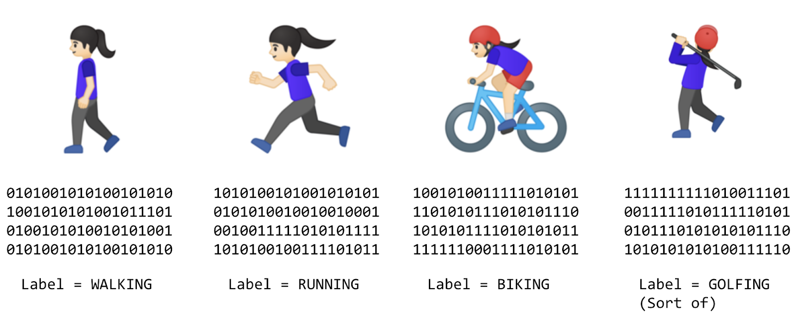

summary: TensorFlow 1
id: tensorflow-1
categories: TensorFlow
tags: workshop
status: Published 
authors: Vlad
Feedback Link: https://discord.com/invite/52amuPv

# TensorFlow 1 : The "Hello World!" of Machine Learning
## Introduction 
Duration: 5

### What We'll Learn 
In this codelab we'll learn the basic "Hello World" of machine learning where, instead of programming explicit rules in a language such as Java or C++, we'll build a system that is trained on data to infer the rules that determine a relationship between numbers.

Consider the following problem: You're building a system that performs activity recognition for fitness tracking. You might have access to the speed at which a person is moving, and attempt to infer their activity based on this speed using a conditional:


```python
if speed < 4: 
  status = WALKING
```
We could extend this to running with another condition:


```python
if speed < 4: 
  status = WALKING
else:
  status = RUNNING
```
In a final condition we could similarly detect cycling:


```python
if speed < 4: 
  status = WALKING
else if speed < 12:
  status = RUNNING
else
  status = BIKING
```
Now consider what happens when we want to include an activity like golf? Suddenly it's less obvious how to create a rule to determine the activity.


```python
# Now what?? :(
```
It's extremely difficult to write a program (expressed in code) that will give us the golfing activity. So what do you do? That's where machine learning can be used to solve the problem!
<!-- ------------------------ -->
## What is machine learning?
Duration: 5

In the previous section you saw a problem where, when trying to determine the fitness activity of a user, we hit limitations in what we could write code to achieve.

Consider building applications in the traditional manner as represented in the following diagram:


You express rules in a programming language. These act on data and your program provides answers. In the case of the activity detection, the rules (the code you wrote to define types of activities) acted upon the data (the person's movement speed) in order to find an answer -- the return value from the function for determining the activity status of the user (whether they were walking, running, biking, etc.).

The process for detecting this activity status via Machine Learning is very similar -- only the axes are different: 


Instead of trying to define the rules and express them in a programming language, you provide the answers (typically called labels) along with the data, and the machine will infer the rules that determine the relationship between the answers and the data. For example, our activity detection scenario might look like this in a machine learning context:



We gather lots of data, and label it to effectively say "This is what walking looks like", "This is what running looks like" etc. Then, the computer can infer the rules that determine, from the data, what the distinct patterns that denote a particular activity are.

Beyond being an alternative method to programming this scenario, this also gives you the ability to open up new scenarios, such as the golfing one that may not have been possible under the rules-based traditional programming approach.

In traditional programming your code compiles into a binary that is typically called a program. In machine learning, the item you create from the data and labels is called a model.

So if we go back to this diagram:


Consider the result of this to be a model, which at runtime is used like this:


You will pass the model some data, and the model will use the rules it inferred from the training to come up with a prediction -- i.e. "That data looks like walking", "That data looks like biking" etc.

In the next section we'll start coding, building a very simple "Hello World" model which will have most of the building blocks that can be used in any Machine Learning Scenario!
<!-- ------------------------ -->
## Before we start
Duration: 5

In the next sections we'll create a very simple machine learned model that determines patterns in a set of data using machine learning techniques and a neural network.

If you've never created a Machine Learning model using TensorFlow, I'd strongly recommend you use Google Colaboratory, a browser-based environment that contains all the required dependencies. You can find the code for the rest of [this lab running in a Colab](https://colab.research.google.com/drive/13dqhjWcDJ-nM9Rj8wdrcWTW_OKVE7F_b).

Otherwise, the main language you will use for training models is Python, so you will need to have that installed. In addition to that you'll also need TensorFlow. Details on installing it are [here](https://www.tensorflow.org/install). You'll also need the [numpy](https://numpy.org/install/) library. 

<!-- ------------------------ -->
## Create your first machine-learned model
Duration: 25

Consider the following sets of numbers. Can you see the relationship between them?

X:  -1    0    1    2    3     4

Y:  -2    1    4    7    10    13

As you look at them you might notice that the X value is increasing by 1 as you read left to right, and the corresponding Y value is increasing by 3. So you probably think Y=3X plus or minus something. Then you'd probably look at the zero on X and see that Y = 1, and you'd come up with the relationship Y=3X+1.

That's almost exactly how you would use code to train a model to spot the patterns between these items of data!

Now let's look at the code to do it.

How would you train a neural network to do the equivalent task? Using data! By feeding it with a set of Xs and a set of Ys, it should be able to figure out the relationship between them.

This is obviously a very different paradigm than what you might be used to, so let's step through it piece by piece.

### Imports

If you are not using the Colab, and have your own Python environment set up, with TensorFlow installed and ready to use, then create a new Python file before continuing.

Let's start with our imports. Here we are importing TensorFlow and calling it `tf` for ease of use.

Next we import a library called `numpy`, which helps us to represent our data as lists easily and quickly.

The framework for defining a neural network as a set of sequential layers is called `keras`, so we import that too.

```python
import tensorflow as tf
import numpy as np
from tensorflow import keras
```

### Define and compile the neural network

Next we will create the simplest possible neural network. It has 1 layer, and that layer has 1 neuron, and the input shape to it is just 1 value.

```python
model = tf.keras.Sequential([keras.layers.Dense(units=1, input_shape=[1])])
```

Next we will write the code to compile our neural network. When we do so, we have to specify 2 functions, a `loss` and an `optimizer`.

If you've seen lots of math for machine learning, here's where it's usually used, but in this case it's nicely encapsulated in functions for you. But what happens here? et's explain...

You know that in the function, the relationship between the numbers is `y=3x+1`.

When the computer is trying to 'learn' that, it makes a guess...maybe `y=10x+10`. The `loss` function measures the guessed answers against the known correct answers and measures how well or how badly it did.

Next, the model uses the optimizer function to make another guess. Based on the loss function's result, it will try to minimize the loss. At this point maybe it will come up with something like `y=5x+5`. hile this is still pretty bad, it's closer to the correct result (i.e. the loss is lower).

The model will repeat this for the number of epochs which you will see shortly.

But first, here's how we tell it to use `mean squared error` for the loss and `stochastic gradient descent` (sgd) for the optimizer. You don't need to understand the math for these yet, but you can see that they work! :)

Over time you will learn the different and appropriate loss and optimizer functions for different scenarios.

```python
model.compile(optimizer='sgd', loss='mean_squared_error')
```

### Providing the data

Next up we'll feed in some data. In this case we are taking the 6 xs and 6 ys that we used earlier. You can see that the relationship between these is that y=3x+1, so where x = -1, y=-2 etc. etc.

A python library called `numpy` provides lots of array type data structures that are a defacto standard way of doing it. We declare that we want to use these by specifying the values as an array in numpy using `np.array[]

```python
xs = np.array([-1.0, 0.0, 1.0, 2.0, 3.0, 4.0], dtype=float)
ys = np.array([-2.0, 1.0, 4.0, 7.0, 10.0, 13.0], dtype=float)
```

You've now written all of the code you need to define the neural network. The next step will be to train it to see if it can infer the patterns between these numbers and use those to create a model.
<!-- ------------------------ -->
## Training the neural network
Duration: 5

The process of training the neural network, where it 'learns' the relationship between the Xs and Ys is in the `model.fit` call. This is where it will go through the loop we spoke about before:aking a guess, measuring how good or bad it is (aka the loss), using the optimizer to make another guess etc. It will do it for the number of epochs you specify. When you run this code, you'll see the loss will be printed out for each epoch.

```python
model.fit(xs, ys, epochs=500)
```

So, for example, you can see here that for the first few epochs, the loss value is quite large, but it's getting smaller with each step:


As the training progresses, the loss soon gets very small:


And by the time the training is done, the loss is extremely small, showing that our model is doing a great job of inferring the relationship between the numbers:


You probably don't need all 500 epochs, and can experiment with different amounts, but as you can see from this example the loss is really small after only 50 epochs, so that might be enough!

<!-- ------------------------ -->
## Using the model
Duration: 5

Ok, now you have a model that has been trained to learn the relationship between X and Y. You can use the `model.predict` method to have it figure out the Y for a previously unknown X. So, for example, if X = 10, what do you think Y will be? Take a guess before you run this code:

```python
print(model.predict([10.0]))
```

You might have thought 31, right? But it ended up being a little over. Why do you think that is?

Neural networks deal with probabilities, so given the data that we fed the NN with, it calculated that there is a very high probability that the relationship between X and Y is Y=3X+1, but with only 6 data points we can't know for sure. As a result, the result for 10 is very close to 31, but not necessarily 31.

As you work with neural networks, you'll see this pattern recurring. You will almost always deal with probabilities, not certainties, and will do a little bit of coding to figure out what the result is based on the probabilities, particularly when it comes to classification.

<!-- ------------------------ -->
## Next steps
Duration: 5

Believe it or not, you've actually already covered most of the concepts in machine learning that you'll use in far more complex scenarios. In this lab you saw how to train a neural network to spot the relationship between two sets of numbers by defining the network. You defined a set of layers (in this case just 1) that contained neurons (also in this case, just 1), which you then compiled with a loss function and an optimizer.

This collection of a network, loss function, and optimizer handles the process of guessing the relationship between the numbers, measuring how well they did, and then generating new parameters for new guesses. As you'll see in the other TensorFlow labs, this process is almost identical to what you'll use for far more complicated scenarios!

You can also learn more at [TensorFlow.org](https://www.tensorflow.org/)